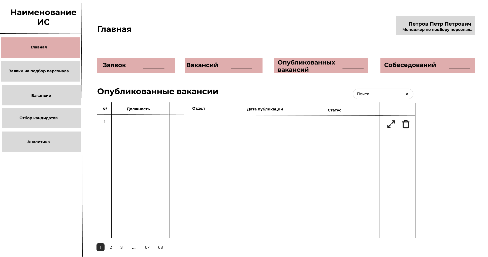

<div align="center">
  

  <h1>HR System</h1>

  <p>
    Информационная система для управления полным циклом подбора персонала —
    от заявки руководителя до предложения о трудоустройстве.
  </p>

  <p>
    <code>React 18</code> · <code>TypeScript</code> · <code>Vite</code> ·
    <code>React Router</code> · <code>Recharts</code>
  </p>
</div>

---



## О проекте

HR System объединяет основные процессы рекрутинга в одном интерфейсе. Система
помогает создавать заявки и вакансии, вести кандидатов по этапам отбора,
оформлять результаты проверок и анализировать эффективность найма.

Интерфейс адаптируется под роль пользователя: администратор, менеджер по
подбору персонала или руководитель подразделения получают доступ только к
нужным им разделам и действиям.

## Возможности

- создание, согласование и отслеживание заявок на подбор персонала;
- управление вакансиями и каналами публикации;
- карточки кандидатов с резюме и контактными данными;
- воронка отбора: анализ резюме, телефонное интервью и собеседование;
- оформление проверки службы безопасности и медицинской проверки;
- подготовка предложения о трудоустройстве;
- аналитические отчёты по воронке, срокам закрытия и причинам отказов;
- справочники отделов, должностей, пользователей, статусов и шаблонов писем;
- ролевая модель доступа и защищённые маршруты;
- сохранение демонстрационных данных между перезагрузками страницы.

## Роли пользователей

| Роль | Основные возможности |
| --- | --- |
| **Администратор** | Полный доступ, управление справочниками и пользователями |
| **Менеджер по подбору** | Вакансии, публикации, кандидаты, проверки, офферы и аналитика |
| **Руководитель подразделения** | Заявки, собеседования с руководителем и аналитика |

## Технологии

| Инструмент | Назначение |
| --- | --- |
| React 18 | Компонентный пользовательский интерфейс |
| TypeScript | Статическая типизация приложения |
| Vite | Локальная разработка и production-сборка |
| React Router | Маршрутизация и защита разделов по ролям |
| Recharts | Графики и аналитические отчёты |
| CSS Modules | Изолированные стили компонентов |
| Playwright | Сценарии браузерного тестирования |

## Быстрый запуск

Для запуска потребуется [Node.js](https://nodejs.org/) версии 18 или новее.

```bash
git clone https://github.com/k5lina/HR_system.git
cd HR_system
npm ci
npm run dev
```

После запуска откройте адрес, указанный Vite — обычно
`http://localhost:5173`.

## Демонстрационные аккаунты

| Роль | Логин | Пароль |
| --- | --- | --- |
| Администратор | `admin@ecomenu.ru` | `admin123` |
| Менеджер по подбору | `manager@ecomenu.ru` | `manager123` |
| Руководитель подразделения | `head@ecomenu.ru` | `head123` |

> Учётные записи и данные предназначены только для демонстрации. Авторизация
> выполняется на стороне клиента и не должна использоваться в production без
> серверной проверки, хеширования паролей и полноценной базы данных.

## Команды

```bash
npm run dev      # запустить сервер разработки
npm run build    # проверить TypeScript и собрать приложение
npm run preview  # локально просмотреть production-сборку
```

## Структура проекта

```text
src/
├── components/   # экраны и UI-компоненты по функциональным разделам
├── context/      # состояние приложения и работа с localStorage
├── data/         # начальные демонстрационные данные
├── types/        # TypeScript-модели предметной области
└── utils/        # вспомогательные функции

designs/          # макеты и примеры экранов
public/           # статические ресурсы
```

## Хранение данных

Текущая версия является клиентским прототипом. Данные хранятся в
`localStorage` браузера и автоматически дополняются демонстрационными
записями. Для возврата к исходному состоянию в приложении предусмотрен явный
сброс данных.

## Автор

[Екатерина Пятлина](https://github.com/k5lina)

