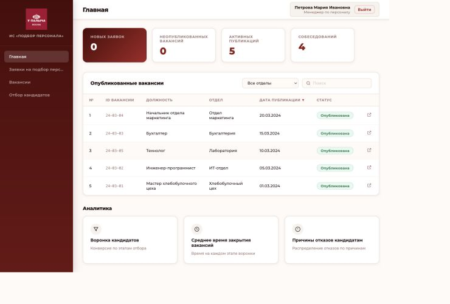

<div align="center">
  

  <h1>Система управления подбором персонала</h1>

  <p>
    Единое рабочее пространство для найма сотрудников в производственной
    компании — от заявки руководителя до выхода кандидата на работу.
  </p>
</div>

---



## Назначение

Система создана для компаний в сфере пищевого производства, где подбор
персонала охватывает офисные подразделения, лаборатории, склады, технические
службы, кондитерские, хлебобулочные и кулинарные цеха.

Она связывает руководителей подразделений и специалистов по подбору в едином
процессе. Каждый участник видит актуальный статус заявки, вакансии и кандидата,
а переход между этапами найма фиксируется в системе.

## Как устроен процесс найма

1. **Руководитель создаёт заявку** — указывает подразделение, должность,
   требования, обязанности, условия и желаемую дату выхода сотрудника.
2. **Специалист по подбору открывает вакансию** и размещает её на подходящих
   каналах поиска.
3. **Отклики собираются в карточках кандидатов** вместе с резюме, контактами и
   результатом первичного анализа.
4. **Кандидат проходит этапы отбора** — телефонное интервью и собеседование с
   руководителем.
5. **Система фиксирует обязательные проверки** службы безопасности,
   медицинской книжки и медицинского осмотра.
6. **Формируется предложение о трудоустройстве**, а результаты найма попадают
   в аналитику.

## Основные возможности

- заявки на подбор с согласованием и контролем статусов;
- единый список вакансий и публикаций по подразделениям;
- база кандидатов и история прохождения отбора;
- телефонные интервью и собеседования с руководителями;
- проверки службы безопасности и медицинских документов;
- подготовка и фиксация предложений о трудоустройстве;
- аналитика воронки кандидатов, сроков закрытия вакансий и причин отказов;
- справочники отделов, должностей, статусов, пользователей и шаблонов писем;
- разграничение доступа по ролям сотрудников.

## Пользователи системы

| Роль | Зона ответственности |
| --- | --- |
| **Администратор** | Настройка справочников, пользователей и доступов |
| **Специалист по подбору** | Ведение вакансий и кандидатов на всех этапах найма |
| **Руководитель подразделения** | Создание заявок и участие в выборе кандидатов |

## Польза для бизнеса

- единый и прозрачный процесс найма для всех подразделений;
- меньше ручной передачи информации между руководителями и подбором;
- контроль сроков и ответственных на каждом этапе;
- сохранение полной истории работы с кандидатами;
- быстрое выявление задержек и причин отказов;
- понятная картина потребности в персонале по цехам и отделам.

## Доступ для просмотра

| Роль | Логин | Пароль |
| --- | --- | --- |
| Администратор | `admin@ecomenu.ru` | `admin123` |
| Специалист по подбору | `manager@ecomenu.ru` | `manager123` |
| Руководитель подразделения | `head@ecomenu.ru` | `head123` |

## Локальный запуск

```bash
git clone https://github.com/k5lina/recruitment-system.git
cd recruitment-system
npm ci
npm run dev
```

После запуска приложение будет доступно по адресу
`http://localhost:5173`.

## Автор

[Екатерина Пятлина](https://github.com/k5lina)
